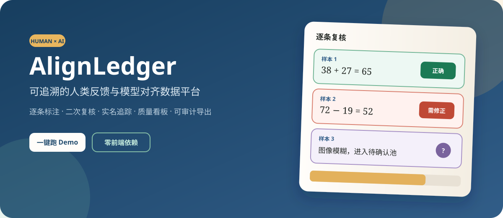
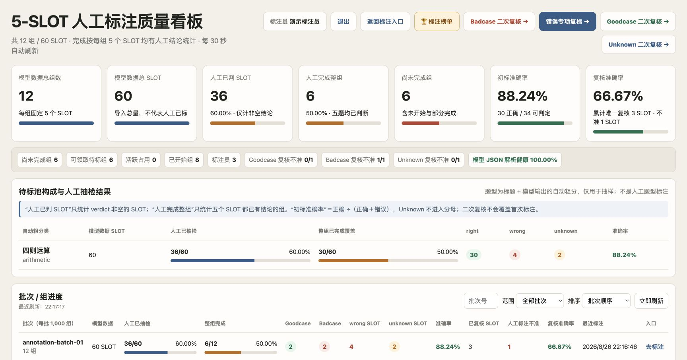
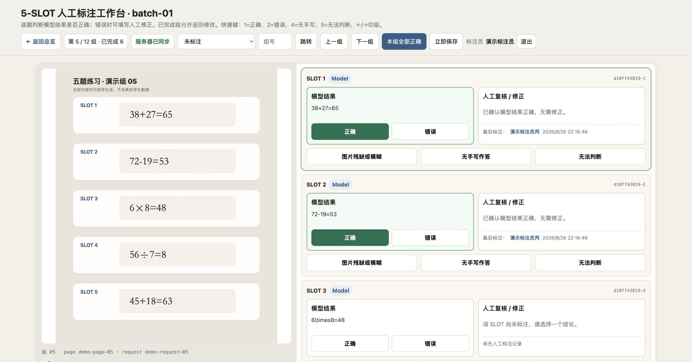
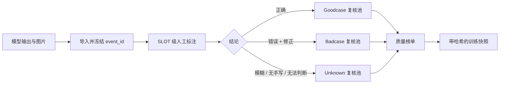

<div align="center">
  

  <br>

  [](https://www.python.org/)
  [](https://www.sqlite.org/)
  [](#测试)
  [](LICENSE)
</div>

五道题挤在一张图里。第一个人标完第三题，第二个人打开同一组；有人点了“下一组”，网络却刚好抖了一下；第二天看板说做完了，组里偏偏还空着两个 SLOT。

这不是一个按钮颜色的问题，而是一整条数据质量链路的问题。

**人工标注平台**是一个面向多 SLOT 视觉任务的轻量标注与复核系统。它把标注、自动保存、冲突保护、二次复核、实名追踪、质量榜单和训练数据导出放进同一套闭环里。前端不依赖框架，后端只用 Python 标准库与 SQLite，一条命令就能跑起来。

> 仓库中的图片、姓名、模型结果与统计数据均为程序生成的演示内容，不含真实业务数据。

## 先跑起来

```bash
git clone https://github.com/znxzsy/human-annotation-platform.git
cd human-annotation-platform
./scripts/run_demo.sh
```

浏览器打开 [http://127.0.0.1:18068](http://127.0.0.1:18068)。首次启动会生成 12 个合成五题组，里面故意放了完整组、部分未标组、Badcase 和 Unknown，方便直接体验完整流程。

也可以使用 Docker：

```bash
docker compose up --build
```

## 它解决什么

### 标到 SLOT，不被整组绑架

- 每个 SLOT 独立选择正确、错误、图片残缺、无手写或无法判断。
- 错误结果可以填写人工修正；已有结论不会被空占位意外清除。
- “部分未标”专门找出一组中只完成了一至四个 SLOT 的漏标案例。
- 正确、错误、Unknown 三类数据分别流入对应复核池。

### 点完就走，保存不添堵

- 前端自动保存草稿，刷新和临时断网都不轻易丢数据。
- 服务端使用版本号与幂等键，拦住旧页面覆盖新结果。
- 已完成组仍可返回修改；标注归属保留到 SLOT 维度。
- SQLite 开启 WAL、完整同步与写入锁，单机部署也能稳妥支撑多人协作。

### 不只统计“做了多少”

- 主看板同时展示总组数、人工已判 SLOT、完整组与剩余组。
- 二次复核按 Goodcase、Badcase、Unknown 分池，可随机抽样，也可指定批次。
- 榜单可以按标注量或准确率排序，并区分“标了多少”和“复核了多少”。
- 导出快照自带 manifest、SHA256 与 `FROZEN_OK`，适合继续构建 SFT、DPO、KTO 数据。

## 界面

<!-- Screenshots are generated from synthetic demo data. -->

| 质量看板 | SLOT 标注工作台 |
| --- | --- |
|  |  |

## 数据怎么流动



平台内部使用稳定的 `event_id + slot` 作为事实主键。组状态只是 SLOT 状态的汇总视图，不会反过来吞掉局部结果。

## 导入自己的五题数据

导入器接受 `details_*.json` 分片。每个 request 需要提供五个 `slot_indices`、图片引用和模型原始输出：

```json
[
  {
    "page_id": "page-demo",
    "slot_items": [
      {"slot_index": 1, "title": "两位数加法"}
    ],
    "requests": [
      {
        "id": "request-demo",
        "slot_indices": [1, 2, 3, 4, 5],
        "image_url": "images/demo.svg",
        "model_raw_content": "[{\"r\":\"38+27=65\",\"h\":0},{\"r\":\"72-19=53\",\"h\":0},{\"r\":\"6\\\\times8=48\",\"h\":0},{\"r\":\"56\\\\div7=8\",\"h\":0},{\"r\":\"45+18=63\",\"h\":0}]"
      }
    ]
  }
]
```

```bash
python -m annotation_platform.importer \
  --details-dir ./my-details \
  --output-dir ./runtime/imported

python -m annotation_platform.server \
  --registry ./runtime/imported/source_groups.jsonl \
  --db ./runtime/review.sqlite3 \
  --audit ./runtime/audit.jsonl
```

导入过程会拒绝不安全的本地图片路径、检查五题结构、计算源文件 SHA256，并生成可复查的 manifest。

## 多人部署与实名邀请码

本地 Demo 默认关闭身份认证。共享部署时，先生成会话密钥与一次性邀请码：

```bash
mkdir -p secrets runtime
python -c 'import secrets; print(secrets.token_hex(32))' > secrets/session-secret
python scripts/generate_invites.py --count 30
```

然后启用认证：

```bash
export ANNOTATION_AUTH_REQUIRED=1
export ANNOTATION_SESSION_SECRET_FILE=secrets/session-secret
export ANNOTATION_COOKIE_SECURE=1
./scripts/run_demo.sh
```

邀请码首次使用时绑定姓名，服务端只保存邀请码哈希。`runtime/invites.txt` 含明文邀请码，应通过私密渠道分发并在分发后妥善保管，绝不要提交到 Git。

## 目录

```text
annotation_platform/
├── annotation_platform/   # HTTP 服务、SQLite Store、导入与导出
│   └── static/            # 无框架前端
├── scripts/               # Demo 数据与邀请码工具
├── tests/                 # 并发安全与页面冒烟测试
├── assets/                # README 视觉素材
└── runtime/               # 本地数据库与审计日志（默认忽略）
```

## 测试

```bash
python -m unittest discover -s tests -v
```

测试只使用 Python 标准库，覆盖部分未标筛选、空占位保护、演示数据库、HTTP API 与主要页面。提交前也建议执行：

```bash
python -m compileall -q annotation_platform scripts tests
```

## 安全边界

- 不要把真实标注数据库、审计日志、邀请码、学生图片或身份映射提交到仓库。
- `.gitignore` 默认屏蔽 SQLite、JSONL、密钥、导出目录和运行时数据。
- 生产环境请置于 HTTPS 反向代理后，并设置 `ANNOTATION_COOKIE_SECURE=1`。
- 平台不会替你完成数据脱敏；公开任何截图或样本前仍需人工复查。

## 为什么开源

标注工具常常从一张临时页面开始，等数据量上来以后，才发现最贵的不是页面，而是丢失的归属、模糊的口径和无法解释的统计。这个项目保留了真实协作中踩过坑后长出来的结构，希望让下一套标注任务不必从同一个坑里重新爬一次。

如果它对你有用，欢迎提 Issue、改进复核策略，或者把它改造成三题、十题乃至任意 N-SLOT 的版本。

## License

[MIT](LICENSE)
