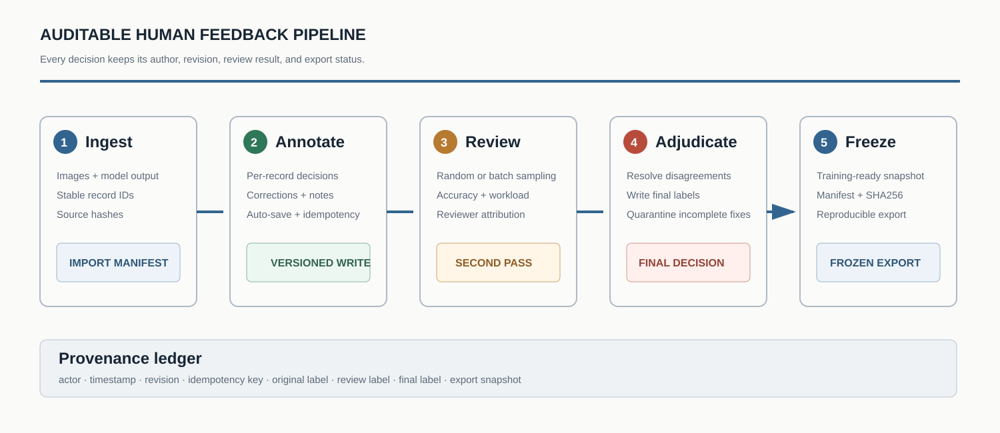

<p align="right"><strong>English</strong> · <a href="README_ZH.md">中文</a></p>

<div align="center">
  
  <br>
  <a href="https://www.python.org/"></a>
  <a href="https://www.sqlite.org/"></a>
  <a href="#testing"></a>
  <a href="LICENSE"></a>
</div>

AlignLedger is a small annotation and quality-control system for RLHF, SFT, DPO/KTO, multimodal evaluation, and other human-feedback workflows. It keeps model output, human corrections, second-pass review, reviewer identity, and final export decisions in one auditable record.

The project uses the Python standard library and SQLite. There is no frontend build step. A local demo starts with one command and creates synthetic records that cover completed, partial, corrected, and unresolved cases.

## Why this exists

Multi-person annotation fails in predictable ways: a stale browser overwrites a newer decision, a network retry creates duplicate writes, a batch looks complete while individual records remain empty, or the exported label can no longer be traced to the person who changed it. AlignLedger handles those cases directly.

Every write carries a version and an idempotency key. Completed records can be edited without losing history. Second-pass review does not overwrite the original annotation. An unresolved correction stays out of the frozen export.

## Workflow

<p align="center"></p>

The server separates initial annotation, review, and final adjudication. Reviewers can sample records at random or select a batch. Quality tables report both accuracy and work volume, with every count derived from stored decisions rather than browser state.

## What is included

- Per-record annotation with correction fields and explicit unknown states
- Automatic draft saving, optimistic version checks, and idempotent writes
- Invite-based identity binding and reviewer attribution
- Separate pools for accepted, corrected, and unresolved records
- Random review, batch review, and final-label adjudication
- Workload and accuracy tables for annotators and reviewers
- Frozen exports with a manifest, SHA256, and `FROZEN_OK`

## Quick start

```bash
git clone https://github.com/znxzsy/AlignLedger.git
cd AlignLedger
./scripts/run_demo.sh
```

Open [http://127.0.0.1:18068](http://127.0.0.1:18068). The first run creates 12 synthetic groups with a mix of complete, partial, corrected, and unknown records.

Docker is also supported:

```bash
docker compose up --build
```

## Import your own data

The importer accepts `details_*.json` shards. Each request supplies stable item indices, image references, and the raw model output.

```bash
python -m annotation_platform.importer \
  --details-dir ./my-details \
  --output-dir ./runtime/imported

python -m annotation_platform.server \
  --registry ./runtime/imported/source_groups.jsonl \
  --db ./runtime/review.sqlite3 \
  --audit ./runtime/audit.jsonl
```

The importer rejects unsafe local image paths, validates record structure, hashes source files, and writes a reviewable manifest.

## Shared deployment and identity

The local demo disables authentication. A shared deployment should use a random session secret and one-time invite codes:

```bash
mkdir -p secrets runtime
python -c 'import secrets; print(secrets.token_hex(32))' > secrets/session-secret
python scripts/generate_invites.py --count 30

export ANNOTATION_AUTH_REQUIRED=1
export ANNOTATION_SESSION_SECRET_FILE=secrets/session-secret
export ANNOTATION_COOKIE_SECURE=1
./scripts/run_demo.sh
```

An invite binds to a name on first use; the server stores only the invite hash. `runtime/invites.txt` contains plaintext codes and must stay outside Git.

## Repository layout

```text
annotation_platform/
├── annotation_platform/   # HTTP server, SQLite store, import and export
│   └── static/            # framework-free frontend
├── scripts/               # demo data and invite tools
├── tests/                 # concurrency, safety, and page smoke tests
├── assets/                # English-only project figures
└── runtime/               # local database and audit logs, ignored by Git
```

## Testing

```bash
python -m unittest discover -s tests -v
python -m compileall -q annotation_platform scripts tests
```

The tests cover partial-record filtering, placeholder safety, correction handling, the demo database, HTTP APIs, and the main pages.

## Public data boundary

The repository contains synthetic fixtures only. Do not commit real annotation databases, audit logs, invite codes, student images, identity mappings, private screenshots, credentials, internal hosts, or exported datasets. See [SECURITY.md](SECURITY.md).

## Collaboration

AlignLedger is intended as a readable base for teams that need stronger review logic than a temporary labeling page. Domain adapters, private deployment, and training-export integration are available through WeChat **`znxzsy`**.

## License

[MIT](LICENSE)
